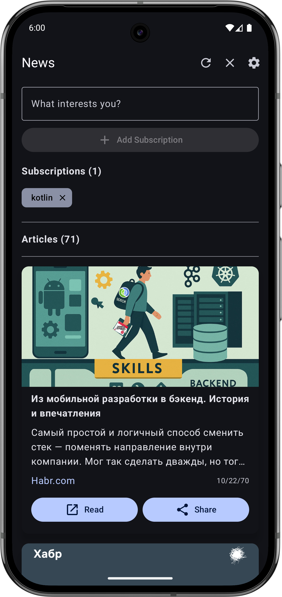
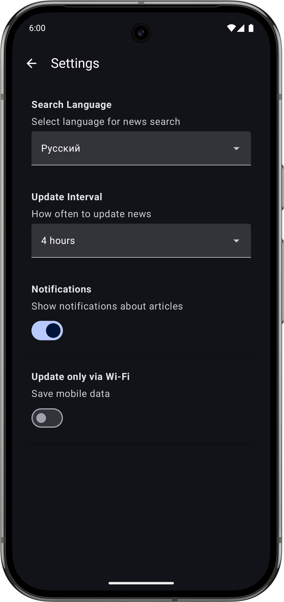

# News App

Мобильное приложение для Android, предназначенное для чтения новостей с возможностью подписки на интересующие темы и получения уведомлений о новых статьях.




## Используемые технологии

### Основные технологии
- **Kotlin**
- **Android SDK**
- **Jetpack Compose**

### Архитектурные компоненты
- **Hilt**
- **Room**
- **WorkManager**
- **Navigation Compose**
- **ViewModel**
- **Flow**

### Сетевые технологии
- **Retrofit**
- **Kotlinx Serialization**
- **Coil**
- **OkHttp**

### Дополнительные библиотеки
- **DataStore** - хранение настроек пользователя

### Gradle плагины
- **[Build Time Tracker](https://github.com/asarkar/build-time-tracker)** - отслеживание времени сборки
- **[Detekt](https://detekt.dev/)** - статический анализ кода Kotlin
- **[Ruler Gradle Plugin](https://github.com/spotify/ruler)** - анализ размера APK и зависимостей

### CI/CD
- **GitHub Actions** - автоматизация сборки, подписи, анализа кода, сбора метрик сборки, анализа размера APK

## API

Приложение использует [newsapi.org](https://newsapi.org/) для получения новостных данных, требуется API ключ (настраивается в `keystore.properties`)

## Фоновое обновление
- Использует **WorkManager** для периодического обновления новостей
- Настраиваемый интервал обновления
- Опция обновления только через Wi-Fi

## Локальное хранение
- **Room** для кэширования статей и подписок
- **DataStore** для настроек пользователя
- Автоматическая синхронизация данных

## Уведомления
- Показ уведомлений о новых статьях
- Настраиваемое включение/отключение

## Сборка и запуск

1. Клонируйте репозиторий
2. Добавьте API ключ News API в файл `keystore.properties`:
   ```
   NEWS_API_KEY="your_api_key_here"
   ```
3. Откройте проект в Android Studio
4. Синхронизируйте Gradle
5. Запустите приложение на устройстве или эмуляторе
